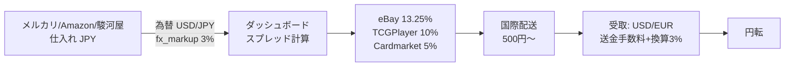
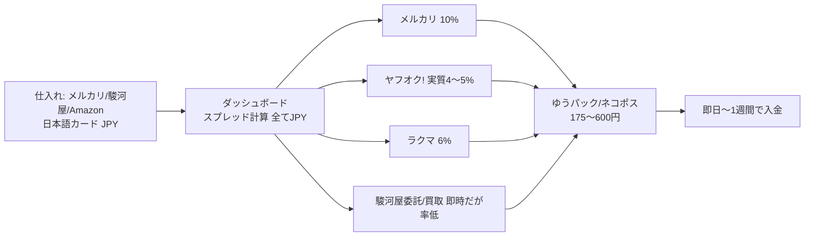
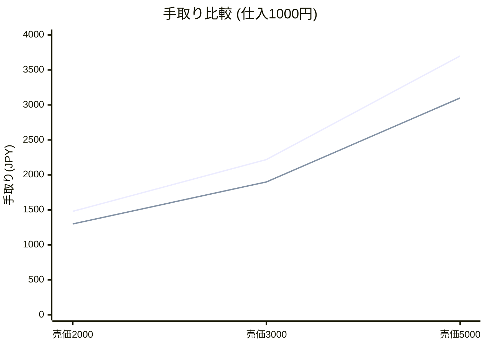
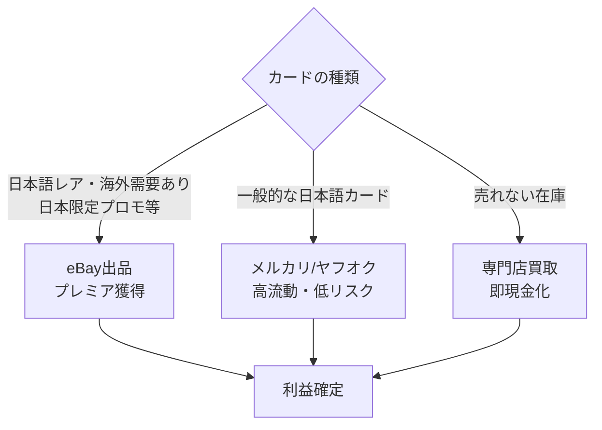

# 利益スキーム分析レポート
**trading-card-dashboard — 現行スキームの評価と国内売却スキームへの転換設計**

*作成日: 2026-08-25 / 本レポートは投資助言ではなく参考値です。*

---

## 1. エグゼクティブサマリー

| 観点 | 現行（海外売却） | 提案（国内売却） |
|---|---|---|
| 手数料合計（目安） | **18〜25%**（落札手数料13.25%＋国際決済1.65%＋為替換算3%＋送金手数料） | **6〜11%**（メルカリ10%／ヤフオク実質4〜5%／ラクマ6%） |
| 為替リスク | **あり**（USD/EUR建、円安・円高で利益変動） | **なし**（全てJPY建） |
| 流動性 | 英語版人気カードは高、日本語版は低 | 日本語版は非常に高い |
| 回収までの期間 | 2〜4週間（国際配送＋送金） | **即日〜1週間** |
| リスク | チャージバック・国際返品・規約停止 | 返品クレーム程度（小さい） |

**結論**: 「日本語カードを海外で売る」現行案は為替・手数料・流動性の三重苦があるため、
**日本語カードのまま国内マーケットプレイスで販売するスキームへの転換を推奨**します。
ただし海外プレミアが付く一部カード（日本限定プロモ等）のみeBay併用のハイブリッドが最適です。

---

## 2. タスクA: 現行スキーム（国内仕入れ→海外売却）の評価

### 2.1 フロー図

### 2.2 長所

| # | 長所 | 詳細 |
|---|---|---|
| 1 | **海外プレミアの捕捉** | 日本語版限定プロモ・旧裏面ポケカは英語圏で2〜5倍の価格になるケースがあり、理論スプレッドが巨大になり得る |
| 2 | **価格発見の非対称性** | 国内フリマは個人出品が多く「安売り」されがち。海外は相場データ(TCGPlayer Market Price)に連動するため定価近くで売れやすい |
| 3 | **競合の少なさ** | 国境を越えたアービトラージを実行する参加者は国内転売より少ない |
| 4 | **為替の追い風** | 円安局面ではドル建て売上が自動的に増幅される |
| 5 | **システム化しやすい** | TCGPlayer/eBayには公開API・相場DBがあり、本ツールのように定量分析しやすい |

### 2.3 短所

| # | 短所 | インパクト |
|---|---|---|
| 1 | **コストの積み重ねが重い** | eBay 13.25% + 海外決済手数料1.65% + 通貨換算約3% + 送金手数料(PayPal等 2〜4%) → **実質20%前後が手数料で消える** |
| 2 | **日本語カードの流動性が低い** | 英語圏の買い手は基本的に英語版を探す。日本語版は翻訳・状態表記の壁で需要が限定的 |
| 3 | **回転が遅い** | 国際配送(1〜3週間)＋入金待ち。資金回転率が悪く、同じ資金で年間回せる回数が減る |
| 4 | **チャージバック・詐欺リスク** | 受取拒否・「説明と異なる」返品時の国際返送料は出品者負担になりがち |
| 5 | **税務・法令の複雑さ** | 輸出免税の要件判定、雑所得申告、継続取引なら古物商許可が必要な可能性 |
| 6 | **為替の逆風** | 円高局面では利益が目減りする（ヘッジコスト別途） |

> ⚠️ 本ツールのシミュレーション値（利益率50%超の候補多数）はモック価格ベースであり、
> 上記のコストを全部乗せすると現実の純利益率は表示の半分以下になる点に注意。

---

## 3. タスクB: 国内売却スキームへの転換設計

### 3.1 新しいフロー図

### 3.2 売却先プラットフォーム比較

| プラットフォーム | 販売手数料 | その他コスト | 入金スピード | TCG流動性 | 備考 |
|---|---|---|---|---|---|
| **メルカリ** | 10% | 振込手数料無料〜 | 数日 | ◎ 最大級 | トレカ専用カテゴリあり。価格競争激しい |
| **ラクマ** | 6% | 振込手数料 | 数日 | ○ | 手数料は安いが流動性はメルカリ次位 |
| **ヤフオク!** | システム利用料1.1%＋あんしん決済手数料（実質4〜5%） | 落札後振込 | 1週間弱 | ◎ 高額レア向け | オークションで相場上限を狙える |
| **駿河屋 委託販売** | 販売代金の約10%＋管理費 | 発送は自分 | 中程度 | △ マニア層向け | 在庫を置きっぱなしにできる |
| **駿河屋 買取** | —（買取率 相場の60〜75%程度） | なし | **即日** | — | 速さ優先の退避先 |
| **TCG専門店買取（ハリーズ等）** | —（買取率 相場の70〜85%） | 出張/宅配買取可 | 即日 | — | 人気カードは高率 |

※手数料率は変更されることがあります。出品前に各社公式ページで最新値を必ず確認してください（要検証）。

### 3.3 損益シミュレーション（仕入1,000円のカード）

| 売価 | 海外eBay売却の手取り* | 国内メルカリの手取り** | 差額 |
|---|---|---|---|
| 2,000円相当 | ¥1,480 | ¥1,300 | 海外+180円 |
| 3,000円相当 | ¥2,220 | ¥1,900 | 海外+320円 |
| 5,000円相当 | ¥3,700 | ¥3,100 | 海外+600円 |

\* eBay 13.25%+0.4$、国際決済1.65%、換算3%、送料600円、為替150円/$想定
\** メルカリ10%、送料175円（ネコポス）

**しかし上記は「売れた場合」の話。** 日本語カードのeBayでの売却確率は低く、
在庫滞留1〜2ヶ月分の機会損失を含めると国内売却の方が期待値で逆転するケースが多い。

---

## 4. 推奨スキーム: ハイブリッド

**判断基準の例**
- TCGPlayer相場に日本語版の掲載があり、海外比1.5倍以上のスプレッド → eBay
- スプレッド1.5倍未満 → メルカリ（回転優先）
- 90日以上滞留した在庫 → 買取で撤退

---

## 5. システム改修タスク一覧

| 優先度 | タスク | 内容 |
|---|---|---|
| P0 | `price_sources.sell` を国内ソースへ変更 | mercari/rakuma/yahoo_auction/suruga を sell 側に追加し link_template を設定 |
| P0 | `FeeConfig.fee_for()` 拡張 | rakuma=0.06, yahoo=0.05, suruga_consignment=0.10 等を追加 |
| P1 | 全JPY化モード | `analysis._fx_to_jpy` の簡略化、fx_markup=0 デフォルト |
| P1 | 送料モデルの精緻化 | サイズ別送料（ネコポス175円/宅急便便60サイズ等）を設定化 |
| P2 | 滞留在庫トラッカー | 出品からの経過日数を記録し、90日で買取推奨アラート |
| P2 | eBay判定フラグ | 海外プレミア検出カードだけeBay候補としてマーク |

## 6. 免責事項
- 手数料率・買取率は2026年8月時点の調査に基づく参考値であり、各社により変更されます
- 本レポートは投資・事業判断の助言ではありません。取引は自己責任で行ってください
